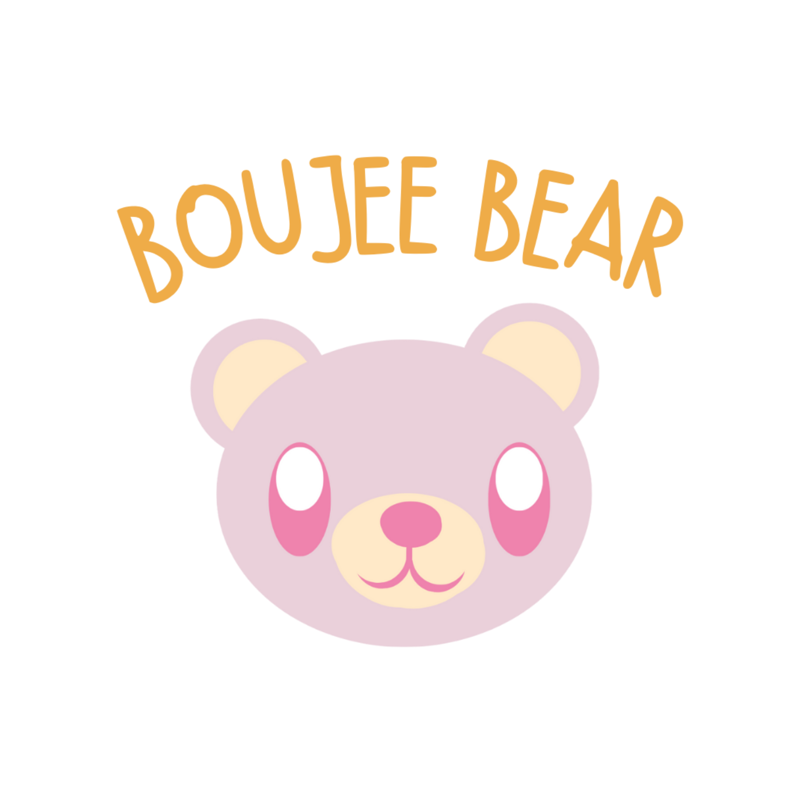

# Boujee Bear

<!-- LOGO -->
 

  

  <h3 align="center">Boujee Bear</h3>

  

    Speak clearly, Be heard!
     
    <a href="https://kidshealth.org/en/parents/not-talk.html"><strong>Additional Info about Delayed Speech or Language Development »</strong></a>
     
  

<!-- TABLE OF CONTENTS -->

  
Table of Contents

  <ol>
    <li>
      <a href="#about-the-project">About The Project</a>
      <ul>
        <li><a href="#built-with">Built With</a></li>
      </ul>
    </li>
    <li>
      <a href="#getting-started">Getting Started</a>
      <ul>
        <li><a href="#prerequisites">Prerequisites</a></li>
        <li><a href="#installation">Installation</a></li>
      </ul>
    </li>
    <li><a href="#usage">Usage</a></li>
    <li><a href="#roadmap">Roadmap</a></li>
    <li><a href="#credits">Credits</a></li>
  </ol>

<!-- ABOUT THE PROJECT -->
## About The Project
A speech impediment in a child arises when their oral components - the mouth, jaw, tongue, and vocal tract - face challenges in coordinating to articulate clear words.
 
 
Around 5% to 15% of the population is impacted by developmental learning disabilities (LDs, as per the American Psychiatric Association's 2013 data).
 
 
This project functions as a supportive companion for both children and their speech educators, providing an excellent means for kids to practice speech improvement comfortably at home while making learning to rectify speech issues engaging through game-based activities.

<!-- Built with -->
### Built With

Major frameworks/libraries used to create project. Leave any add-ons/plugins for the acknowledgements section. Here are a few examples.

